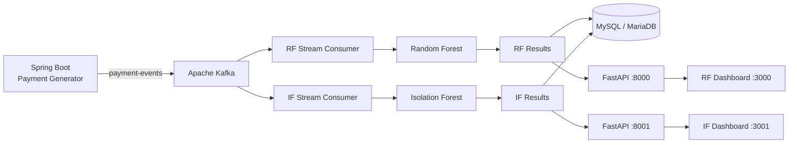

# Real-Time Payment Fraud Detection System

결제가 발생하는 순간, 두 가지 머신러닝 모델이 이상 징후를 탐지합니다.

Kafka 기반 결제 이벤트 스트리밍과 Random Forest·Isolation Forest 모델을 결합해 실시간으로 이상거래를 판별하고, 탐지 결과와 통계를 대시보드에서 비교·모니터링하는 FDS(Fraud Detection System) 프로젝트입니다.

## 프로젝트 소개

온라인 결제 사기는 짧은 시간 안에 반복되거나, 평소와 다른 금액·기기·IP·시간대에서 발생하는 경우가 많습니다. 거래가 끝난 뒤 데이터를 일괄 분석하는 방식만으로는 이러한 위험에 즉시 대응하기 어렵습니다.

이 프로젝트는 Spring Boot가 생성한 결제 이벤트를 Kafka로 전달하고, 스트림 소비 단계에서 최근 거래 빈도를 계산한 뒤 Random Forest와 Isolation Forest로 이상 여부를 판별합니다. 판정 결과는 FastAPI를 통해 제공되며, React 대시보드에서 최근 거래, 이상거래 수, 탐지 비율과 시간대별 추이를 확인할 수 있습니다.

## 핵심 기능

- **실시간 결제 이벤트 생성**: 정상·이상 패턴을 포함한 가상 결제 데이터를 Spring Boot에서 지속적으로 생성
- **Kafka 이벤트 스트리밍**: `payment-events` 토픽을 통해 프로듀서와 탐지 시스템을 분리
- **실시간 피처 계산**: 60초 이내 계정 및 기기별 거래 이력을 이용해 `freq_score` 계산
- **Random Forest 탐지**: 지도학습 모델로 학습된 사기 패턴을 기반으로 거래 판별
- **Isolation Forest 탐지**: 정상 거래 분포에서 벗어난 이상치를 비지도학습 방식으로 탐지
- **탐지 결과 저장**: `kafka-python` 소비 경로에서 판정 결과를 MySQL 호환 DB에 적재
- **REST API 제공**: 모델별 최근 거래 목록, 탐지 통계 및 서버 상태 제공
- **실시간 대시보드**: 2초 간격으로 데이터를 조회해 거래 현황, 이상거래 비율, 추세와 알림 표시

## 기술 스택

| 구분 | 기술 |
| --- | --- |
| Event Producer | Java 17, Spring Boot 3.4, Spring Kafka, Spring Data JPA |
| Message Broker | Apache Kafka, ZooKeeper |
| Stream Processing | Spark Structured Streaming, kafka-python |
| Machine Learning | Python, scikit-learn, pandas, joblib, Random Forest, Isolation Forest |
| API | FastAPI, Uvicorn |
| Database | MySQL / MariaDB 호환 |
| Frontend | React 18, Axios, Recharts |
| Infrastructure | Docker, Docker Compose |

## 시스템 아키텍처



결제 이벤트 생성기와 탐지기를 Kafka로 분리해 각 구성 요소가 독립적으로 실행될 수 있도록 했습니다. RF와 IF 탐지기는 서로 다른 consumer group과 API를 사용하므로 동일한 이벤트를 각각 처리하고 결과를 비교할 수 있습니다.

## 주요 설계

### 두 모델을 이용한 탐지 비교

Random Forest는 라벨이 있는 학습 데이터에서 사기 패턴을 학습해 거래를 분류합니다. Isolation Forest는 정상 데이터 분포에서 멀리 떨어진 거래에 이상 점수를 부여합니다. 두 모델을 별도의 탐지기와 대시보드로 구성해 지도학습과 비지도학습 방식의 결과를 독립적으로 관찰할 수 있습니다.

과거 실험에서 Random Forest는 threshold `0.35`와 SMOTE를 적용해 약 93% 수준의 Precision과 90% 수준의 Recall을 기록했습니다. Isolation Forest는 contamination을 실제 사기 비율에 가깝게 조정하는 과정에서 다음과 같은 변화를 확인했습니다.

| 모델·설정 | Precision | Recall | F1 Score | 비고 |
| --- | ---: | ---: | ---: | --- |
| Random Forest | 약 93% | 약 90% | - | threshold 0.35, SMOTE |
| Isolation Forest, contamination 0.05 | 43.8% | 66.7% | 0.53 | 초기 실험 |
| Isolation Forest, contamination 0.035 | 86.6% | 80.6% | 0.83 | 사기 비율 반영 실험 |

> 위 수치는 과거 실험 기록입니다. 현재 사용 중인 저장 모델의 학습 설정과 성능은 모델 아티팩트 및 학습 코드를 기준으로 확인해야 합니다.

### 스트리밍 기반 거래 빈도 계산

소비자는 계정과 기기별 최근 이벤트 시각을 메모리에 유지합니다. 60초가 지난 기록을 제거한 뒤 현재 거래를 추가하고, 두 기준의 거래 횟수를 합산해 `freq_score`를 계산합니다. 이 값은 정적 CSV가 아니라 실시간 이벤트 흐름에서 만들어지는 피처입니다.

```text
Kafka event
    ├─ accountNo 기준 최근 60초 거래 수
    ├─ deviceId 기준 최근 60초 거래 수
    └─ freq_score 계산
            ↓
      RF / IF 모델 예측
            ↓
      메모리 결과 + DB 저장
            ↓
      FastAPI → React Dashboard
```

### Spark 경로와 경량 소비 경로

각 탐지기는 두 가지 Kafka 소비 방식을 제공합니다.

- `spark_consumer.py`: Spark Structured Streaming의 micro-batch와 `foreachBatch`를 이용한 처리
- `consumer.py`: `kafka-python`을 이용한 직접 소비 및 DB 적재

Spark 버전과 Kafka connector 호환 문제가 발생했을 때도 탐지 파이프라인을 검증할 수 있도록 경량 소비 경로를 함께 유지합니다. 현재 `api.py`는 Spark 소비 모듈을 시작하므로, DB 적재가 필요한 실행에서는 사용할 소비 경로를 먼저 확인해야 합니다.

### 모델별 피처 변환

이벤트의 원본 필드를 모델 입력값으로 변환합니다.

| 피처 | 설명 |
| --- | --- |
| `amount` | 결제 금액 |
| `hour` | 거래 시간대 |
| `ip_last` | IP 주소의 마지막 옥텟 |
| `device_num` | 기기 식별자에서 추출한 숫자 |
| `freq_score` | 최근 60초 계정·기기 거래 빈도 |
| `failed_count` | 최근 7일 결제 실패 횟수 |
| `device_changed` | 평소와 다른 기기 사용 여부 |
| `ip_changed` | 평소와 다른 IP 대역 사용 여부 |

실제 입력 피처는 저장된 모델의 메타데이터와 모델별 feature 파일을 우선합니다. 현재 RF와 IF 모델이 사용하는 피처 구성이 완전히 같다고 가정하지 않습니다.

## 프로젝트 구조

```text
capstone/
├── payment-generator/               # Spring Boot 결제 이벤트 생성기
├── capstone/
│   ├── RF-fraud-detector/
│   │   ├── spark_consumer.py         # Spark 기반 RF 스트림 처리
│   │   ├── consumer.py               # kafka-python 기반 처리 및 DB 적재
│   │   ├── detector.py               # RF 모델 로드 및 예측
│   │   ├── api.py                    # FastAPI, port 8000
│   │   └── fraud_model.pkl
│   ├── IF-fraud-detector/
│   │   ├── spark_consumer.py         # Spark 기반 IF 스트림 처리
│   │   ├── consumer.py               # kafka-python 기반 처리 및 DB 적재
│   │   ├── detector.py               # IF 모델 로드 및 예측
│   │   ├── api.py                    # FastAPI, port 8001
│   │   ├── isolation_forest_model.pkl
│   │   └── if_features.pkl
│   ├── RF-fraud-dashboard/           # RF 실시간 대시보드
│   └── IF-fraud-dashboard /          # IF 실시간 대시보드
└── docker-compose.yml                # Kafka, ZooKeeper, MySQL 등 실행 구성
```

현재 저장소에는 과거 실험 결과와 인수인계 사본도 포함되어 있습니다. 실행 전에는 위 경로와 실제 디렉터리명을 확인하세요.

## API 개요

RF API의 기본 주소는 `http://localhost:8000`, IF API의 기본 주소는 `http://localhost:8001`입니다.

| Method | Endpoint | 설명 |
| --- | --- | --- |
| `GET` | `/health` | API 서버 상태 확인 |
| `GET` | `/transactions?limit=50` | 최근 탐지 거래 조회 |
| `GET` | `/stats` | 전체 거래, 정상·이상거래 수와 탐지 비율 조회 |

`/transactions` 응답 예시:

```json
{
  "data": [
    {
      "transactionId": "JUI_12AB34CD",
      "amount": 420000,
      "hour": 3,
      "freqScore": 7,
      "failedCount": 5,
      "isFraud": true,
      "anomalyScore": -0.1243
    }
  ],
  "count": 1
}
```

## 데이터베이스

`kafka-python` 소비 경로는 `fraud_detections` 테이블을 생성하고 탐지 결과를 저장합니다.

```text
id, transaction_id, amount, hour, freq_score,
failed_count, is_fraud, anomaly_score, model_type, detected_at
```

Spring Boot 이벤트 생성기는 원본 결제 이벤트를 `payment_event` 테이블에 저장하며, 데이터가 10,000건을 초과하면 오래된 거래를 정리합니다.

## 로컬 실행

### 1. 인프라 실행

```bash
docker compose up -d zookeeper kafka mysql
```

Docker Kafka를 호스트에서 사용할 때는 현재 Compose 설정상 `localhost:9094`, 컨테이너 사이에서는 `kafka:9092`를 사용합니다. Homebrew Kafka의 `localhost:9092`와 혼용하지 않도록 실행 위치에 맞는 bootstrap 주소를 설정해야 합니다.

### 2. 결제 이벤트 생성기 실행

```bash
cd payment-generator
./gradlew bootRun
```

### 3. 탐지 API 실행

```bash
cd capstone/RF-fraud-detector
python3 api.py
```

다른 터미널에서:

```bash
cd capstone/IF-fraud-detector
python3 api.py
```

### 4. 대시보드 실행

```bash
cd capstone/RF-fraud-dashboard
npm start
```

IF 대시보드는 현재 실제 디렉터리명에 포함된 공백을 확인한 뒤 실행합니다.

```bash
cd "capstone/IF-fraud-dashboard "
PORT=3001 npm start
```

### 로컬 주소

| 서비스 | URL |
| --- | --- |
| RF FastAPI | `http://localhost:8000` |
| IF FastAPI | `http://localhost:8001` |
| RF Dashboard | `http://localhost:3000` |
| IF Dashboard | `http://localhost:3001` |
| Spark Master UI | `http://localhost:8080` |


## 현재 개발 상태

이 프로젝트는 로컬 통합 환경을 정리하는 단계입니다. 현재 우선 과제는 다음과 같습니다.

- Docker Kafka와 로컬 프로세스 사이의 listener 및 포트 설정 통일
- Spark-Kafka connector 버전 호환성 확인
- `process_batch` 미호출 원인과 consumer offset/checkpoint 상태 점검
- Spark 처리 결과의 DB 적재 경로 통합
- 실행 설정과 실제 DB 이름·포트 정합성 확보
- RF/IF 대시보드의 모델명과 실행 포트 최종 검증

현재 권장 방향은 Kafka와 DB만 Docker에서 실행하고, Spring Boot·Python·React는 로컬에서 실행하는 구성입니다.

## 주의사항

- Java의 boolean 필드가 직렬화 과정에서 `isFraud`가 아닌 `fraud`로 전달될 수 있으므로 실제 Kafka 메시지 스키마를 확인해야 합니다.
- Spark checkpoint를 삭제하면 offset과 재처리 범위에 영향을 줄 수 있습니다.
- 탐지기의 `results`는 프로세스 메모리에 유지되므로 API를 재시작하면 초기화됩니다.
- Isolation Forest의 contamination 값은 실험 버전마다 다르므로 문서값만 보고 모델을 재학습하지 않습니다.
- 저장소의 환경 설정에는 로컬 비밀값이 포함될 수 있으므로 공개 저장소에 올리기 전에 반드시 제거하거나 환경 변수로 분리해야 합니다.
